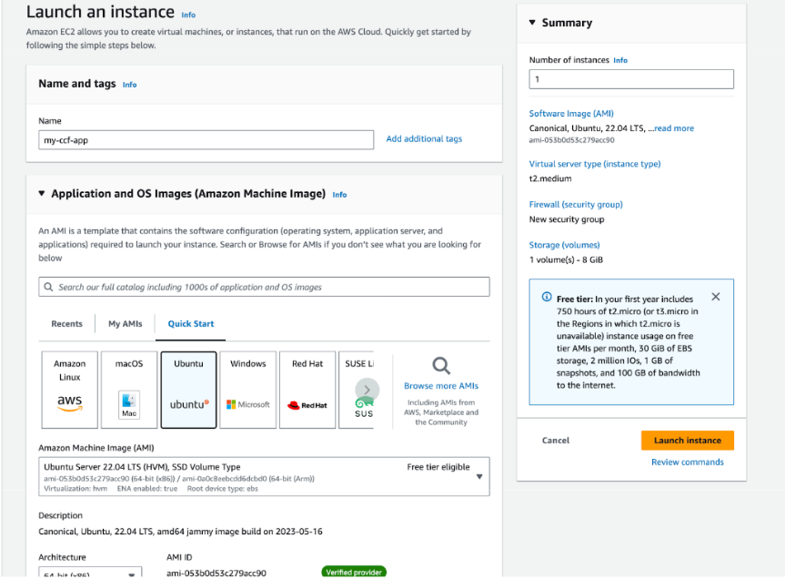
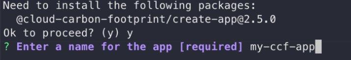
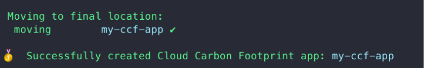

Since the launch of Cloud Carbon Footprint (CCF), our team always aimed to maintain and develop flexibility in both how the tool is used and the options for its deployment. With such a large variety of infrastructure across organizations, we strive to balance supporting as many environments out of the box as possible while also preserving the customization options you may need.

One of the most popular options for both piloting a CCF instance as a proof of concept as well as for an internal production environment is to run CCF within a virtual machine. After all, it is a great way to get your feet wet with CCF without bringing extra dependencies on your local machine, tying up any resources, and enabling options for an always-on service that expands beyond your local machine. Alternatively, you may want to get creative by customizing or automating how CCF fits into your use cases. For example, perhaps you may want to set up a cloud function that automatically fetches cloud estimates for every recent day, week, or month? Or maybe you want a fully accessible CCF API for members of your organization or team to query? If any of these benefits sound appealing then the VM option might be for you, and you’re in the right place!

Virtual machines come in many shapes and sizes across different cloud provider platforms, including AWS EC2, Google Cloud Compute Engine, and Azure Virtual Machine services. For the sake of this article, we’ll be focusing on how to create a CCF application running on an AWS EC2 instance. However, depending on the chosen operating system or distribution of your machine, the steps should be relatively the same!

## Creating your EC2 Instance

CCF at its core is a Node application running Express.JS for its API and React for its client. So once you have the environment setup for one endpoint of the application, you’ll be able to run instances of CCF’s API, CLI, and Client on the same machine, and switch between them if desired. Before we do that, let’s create our machine and set up our environment.

To start, we assume that you already have the following:

- An existing AWS account with permissions for creating and managing EC2 instances
- Followed the steps for setting up billing data for your [cloud provider](https://www.cloudcarbonfootprint.org/docs/aws) (i.e. AWS steps 1-3)
- Basic familiarity with navigating the AWS console

Let’s navigate to the EC2 dashboard and select the option to launch a new instance using the shiny “Launch Instances” button:


From this point, we’ll be selecting the configuration options for our new machine. While the free tier may be tempting, we’ll go with a t2.medium. I’ve found that on smaller instances such as a t2.micro, the limited hardware can sometimes cause issues when installing node modules or running the app. So we could use the extra “oomph”. However, for the sake of your own instance, please consider the following:

- If you’re expecting a large amount of estimates, consider a larger instance with higher memory and compute power.
- If you plan on running a [MongoDB instance](https://www.cloudcarbonfootprint.org/docs/data-persistence-and-caching#mongodb-storage) on the same machine and persisting a large amount of estimates, consider increasing the storage capacity of your instance.
- If costs and efficiency is top of mind, consider choosing the option for an ARM instance as you will not be able to migrate from a non-ARM instance afterwards.
- Running EC2 instances incur costs! So make sure to stop/delete instances when done with them and that you choose a capable instance that fits within your budget.



You may also notice that we’ll be going with an Ubuntu image as our operating system – a popular and widely accepted distribution that you can use with any VM host. You’re welcome to choose a different Linux-based operating system such as Amazon Linux in the case of an EC2 instance. Amazon Linux serves as a Linux distribution optimized for running in AWS. It is also optimized for running most Linux-based software making the steps you’ll follow almost identical. For the sake of keeping this tutorial a little more friendly for other cloud VM services, we’ll be sticking with Ubuntu.

After making some final decisions in creating a key pair (required for connecting via an SSH client) and choosing a security group, we’re going to hit the even more shiny “Launch Instance” button. After a short wait, you should see a notification that the instance has been created and is running. So let’s connect to it!

_Side Note_: If you’re more comfortable with the [cloud provider CLI](https://aws.amazon.com/cli/) or other ways of configuring resources, these steps can be replicated using those methods as well.

## Setting Up Your CCF Instance

Connect to your instance using your preferred method – whether it be in the cloud provider console or through a local terminal via SSH. Once you’re in, we will need to configure NPM and Node so that our server can support CCF’s code.

### Installing Node.JS

We’ll be following the officially recommended steps for [setting up Node.JS on an EC2 Instance](https://docs.aws.amazon.com/sdk-for-javascript/v2/developer-guide/setting-up-node-on-ec2-instance.html). Henceforth, we will be relying on NVM to make this an easy process! [NVM](https://www.bing.com/search?pglt=641&q=nvm&cvid=ef35fe5448b345eba7740e8aae9b0b8e&aqs=edge..69i57j0l5j69i61l3.383j0j1&FORM=ANNTA1&PC=U531) will manage our versions of Node for us, making migrating or downgrading easier.

```console
curl -o- https://raw.githubusercontent.com/nvm-sh/nvm/v0.39.5/install.sh | bash
```

We then need to activate NVM by running the following command:

```console
. ~/.nvm/nvm.sh
```

You can verify that it is active by running `nvm -v` in which you should see an output of `0.39.5` or similar.

CCF requires NodeJS 16 or later. While I prefer 18 since it is the current LTS release, you will need to run the following command – replacing the number with the version that you wish to install:

```console
nvm install 18
```

_Note_: Make sure to check the latest version compatibility that your image supports. For example, Amazon Linux 2 does not support Node 18 at the time of writing this article.

NVM will also inform you that it is setting the current version as the default. This is useful for whenever you need to switch node versions or have node disabled for some reason, as you can use `nvm use –default` to re-enable it. You can verify that Node is successfully installed by running `node -v`, in which you should see an output of the version that you installed.

### Installing Yarn

While installing node also automatically installs npm, CCF uses [Yarn](https://v3.yarnpkg.com/) as its package manager. Fortunately, Node 16 and up make it super easy to install thanks to its inclusion of [corepack](https://github.com/nodejs/corepack).

To install Yarn, we simply need to enable corepack using the following command:

```console
corepack enable
```

With a little magic, you can now use `yarn -v` to verify that yarn is now installed and enabled in your server. You’ll see that version 1 (yarn classic) is enabled. If you’ve been reading the CCF documentation, you may notice that it requires Yarn 3. Do not fear, CCF will take care of the upgrade during its installation.

Now for the fun part!

### Installing CCF

There are multiple ways to install CCF, as noted in the [Getting Started](https://www.cloudcarbonfootprint.org/docs/getting-started) section. While you can clone the app and get full access to all of its packages and latest features as soon as they are available, we’re going to go with the [Create App](https://www.cloudcarbonfootprint.org/docs/create-app) option as the more stable and simple solution.

To get started, we will run the create-app command with an additional flag to note that we wish to skip the `yarn install` step. This gives us flexibility in case we wish to connect our data using the [guided install](https://www.cloudcarbonfootprint.org/docs/getting-started#guided-install) process, which will end up doing the installation step for us.:

```console
npx @cloud-carbon-footprint/create-app --skip-install
```

You’ll be asked to install the latest version of the `create-app` package, in which you can reply “yes”.



When prompted for a name, feel free to choose whichever name you prefer your app to have. In this example we’ll be going `my-ccf-app`. Take note that this will also be the name of the directory that the app will be created in. So you may want to make sure the name is unique and matches any folder naming conventions you may have.

Afterwards, you’ll see that the script takes care of creating your files and moving them to a directory named after your app. Your app will be successfully created!



Use `cd my-ccf-app` to switch to the directory of your app. You should see the following contents within your directory:

```console
lerna.json  package.json  packages  tsconfig.json
```

_Note_: If you run `yarn -v` again while in the directory, you’ll see that the version has automatically updated to 3.1.1 like magic. ✨

At this moment, you can either connect your data by manually creating a `.env` file in either your `packages/api` or `packages/cli` directory based on the `.env.template` files in those same directories. Make sure to check out the documentation on how to connect data for your chosen cloud provider:

- [AWS](https://www.cloudcarbonfootprint.org/docs/aws)
- [Google Cloud](https://www.cloudcarbonfootprint.org/docs/gcp)
- [Azure](https://www.cloudcarbonfootprint.org/docs/azure)

Alternatively, you can use the guided installation method mentioned above to run a friendly CLI program that will walk you through setting up your credentials and will create the `.env` files for you!

If you’d rather skip connecting your data altogether, you can also [run with mock data](https://www.cloudcarbonfootprint.org/docs/run-with-mocked-data) instead and move on to the next step.

## Running Your App

After following the setup method of your choice, let’s top things off by doing a `yarn install`. Once the dependencies are done installing, we’re good to [start our app](https://www.cloudcarbonfootprint.org/docs/getting-started#starting-the-app)!

You can now use `yarn start` to concurrently start both the Client (react dashboard) and the API (express app).

- If running the client or with mock data, your CCF Dashboard will be available at port 3000 of your instance. You can view the dashboard by navigating to the public IP of your instance followed by the corresponding port.
  - Please note, you will need to configure your security or network settings to make this port available
- You can also use `yarn start-api` instead to only [run the API](https://www.cloudcarbonfootprint.org/docs/running-the-api). You can verify that the API is running by making a request to one of the endpoints on port 4000 of the instance.
  - For example, try making the following command in another terminal instance:
    <br/>
    `curl http://[your-ip]:4000/api/regions/emissions-factors`
  - Please note, you will need to configure your security or network settings to make this port available if attempting to make requests outside of the instance.
- You can also use yarn `start-cli` for [running the CLI](https://www.cloudcarbonfootprint.org/docs/running-the-cli) and requesting estimates directly within the terminal.

Congratulations! You now have successfully created a CCF app running in a virtual machine.

You may notice that if you exit the SSH or terminal session, that the running process will not persist. In this case, you can use a tool such as a [Screen](https://www.gnu.org/software/screen/) to create an uninterruptible terminal session to run your app in. To do so, try running the following command:

```console
screen -S ccf
```

This will create a new Screen session called “ccf”. From here, you can run one of the `yarn start` commands to run your app and then use `ctrl+a` `ctrl+d` command keys to detach from the session. The session will stay on in the background and your CCF app will stay running!

You can always reattach to the session by entering `screen -r` in your terminal.

If you’re more comfortable and don’t like the idea of having terminal sessions running in the background, you can also create a `.service` file to [run your application as a background service](https://stackoverflow.com/questions/4018154/how-do-i-run-a-node-js-app-as-a-background-service) instead.

## What Now?

Now that you have an always-running CCF instance on a cloud-based virtual machine, you can now continue to explore both realtime and historical estimates for all of your services in the cloud. If you’d like to explore additional ways to enhance your CCF app, consider the following:

- [Running the CCF App with Docker](https://www.cloudcarbonfootprint.org/docs/run-with-docker)
- Creating a cron-triggered cloud function to automatically fetch new estimates
- Configuring a MongoDB instance to [persist new and historical estimate data](https://www.cloudcarbonfootprint.org/docs/data-persistence-and-caching#mongodb-storage)
- Using the CLI app to [seed data into the configured cache option](https://www.cloudcarbonfootprint.org/docs/data-persistence-and-caching#seeding-cache-file) for your instance
- Creating an internal dashboard for your team or organization to view estimate data

Hopefully you’ve found this walkthrough helpful and see that this is only the beginning of your cloud carbon footprint journey and taking steps to help create a greener cloud! For more walkthroughs and technical deep dives, make sure to keep following the [CCF Blog](http://cloudcarbonfootprint.org/blog) and share your experience on our [discussions page](https://github.com/cloud-carbon-footprint/cloud-carbon-footprint/discussions)!
