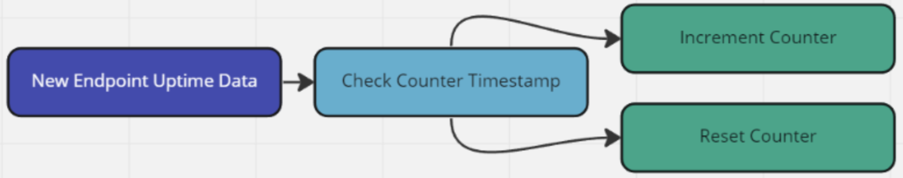
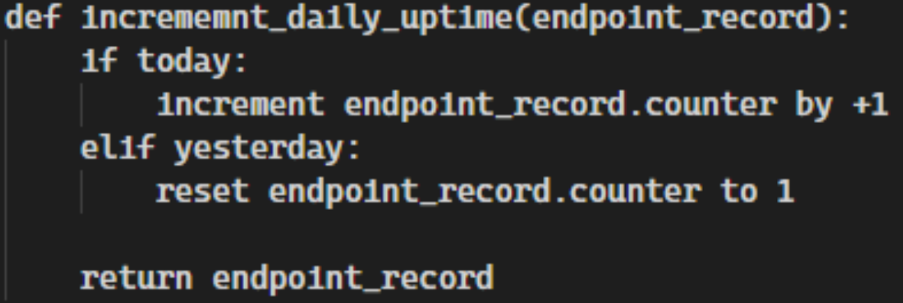
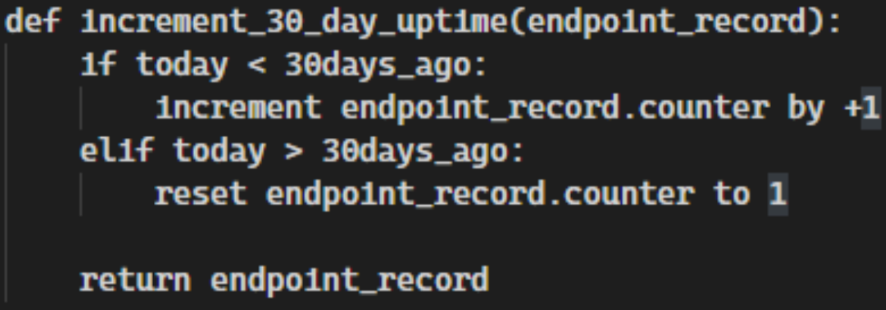

## Forward

Embarking on the journey of collecting data for your on-premise resources can at first seem like an impossible task. What data do I actually need? Do you have the right tooling? What stakeholders are you going to need, and how much time is this going to take? Where do you store the data? Most importantly, how do you get the data once you identify the tooling available to you? We’ll cover all of that below, but first just know that despite your initial trepidation; endpoint data exists in countless tools. With a little creativity and knowhow, you should have no trouble identifying, retrieving, and storing endpoint data to be utilized within the CCF Dashboard..

## Getting Started With On-Premise Data Collection

### The On-premise data model

The CCF CLI takes in on-premise data using a predefined model. This model dictates the type, content, and format of the data needed in order to facilitate and proper and accurate data import and manipulation. You can view the current custom data model, as well as methodology write ups in the [On-Premise](https://www.cloudcarbonfootprint.org/docs/on-premise/) parts of the CCF docs . The data model contains a lot of common fields such as CPU cores, memory, and where in the world a particular machine is located. We’ll cover these in more detail as we continue on, however just keep in mind that we need all of this data for each endpoint to provide accurate estimates.

### Data Sources

Your organization will most likely contain a multitude of sources from which endpoint data can originate. From computer accounts in Active Directory to System information stored within tools such as your Antivirus or system patching tools; large swathes of data are stored. It’s in these places you’ll be looking for your target endpoints and pulling relevant data from these sources to populate the On-Premise data model.

Endpoint data can also come from some unlikely places. If you are finding yourself lost in your search for endpoint data, think of the following list of tooling to see if perhaps your IT department has one of these tools:

- Antivirus suites
- Vulnerability management suites
- CMDB applications (Inventory management)
- Configuration management suites
  - Puppet
  - Chef
  - SCCM
  - MEM
- System monitoring suites
  - Nagios
  - Cacti
  - Grafana
    - Node Exporter
    - Telegraf
    - Prometheus Databases

The list goes on and on. There are countless tools currently available for organizations to perform a wide range of tasks related to endpoint management, monitoring, and protection. The wonderful thing about tooling such as this is that they also rely on large amounts of data related to the endpoint. Antivirus tools need to know if the machine has been online and communicating with the management console for updates and status information. Monitoring tools rely solely on doing exactly what their name suggests–monitoring endpoints. CMDB tools are directly responsible for endpoint and inventory management. Many IT departments consider CMDB tooling a source of endpoint and inventory truth. Data here is likely to be very accurate.

    NOTE: Keep in mind the permissions needed to access these data sources, and ensure you’re following your company's best practices on the retrieval and storage of this data. Where possible, always partner with the data source owner to ensure you’re not only getting the best data, but handling it in a manner that doesn’t expose your company to unnecessary risks or security incidents.

 

Data sources are the most important part of embarking on a journey of tracking and estimating the environmental impacts of your enterprise. As you begin, be creative and leverage your existing partnerships with various departments within your organization to find these unlikely sources of data. Continue to rely on the On-premise Data Model to match data sources with the required fields.

When choosing a data source, be mindful of the size of the dataset, and your ability to continually pull data out. Intermittent, or services with unreliable uptimes are not preferable sources. Data sources with large datasets that cannot be filtered or compressed may prove difficult or costly to ingest. Always try to choose data sources that have exposed API’s if possible. This will make automating and scheduling data collection far simpler in the long run. If API’s are simply not possible, strive instead for tooling that can generate scheduled reports containing the data you need. If possible opt for CSV, JSON, XML outputs that you can use easily with your data collection and storage processes. We’ll cover this in the section _Collecting on-premise data_.

Before we move on to the means and methods in which you might collect and store this data, bear in mind that some of the fields in the On-premise Data Model are to be collected over time. We will go into greater detail about these fields later on. Just understand that your chosen data source does not necessarily have to include this data. You may be able to generate the data with good automation, and scheduled data retrieval from other information provided by the data source.

- dailyUptime
- weeklyUptime
- monthlyUptime
- annualUptime

Once you have a source of data to utilize, you’ll be using that data to calculate the above fields.

### Data Collection and Storage Technologies

For example’s sake, let’s say you have chosen your AntiVirus as your initial data source. This tool contains all the basic information needed for the On-premise Data Model, and it has a robust REST API that can be utilized to fetch the data. Where do we go from here? Let’s have a look at a basic workflow diagram.

This is the simplest possible way to represent the actions to be taken when it comes to collecting and storing data. Although simple to visualize, the means in which you achieve this goal can grow from very simple to very complex depending on the amount of data you will have, the length of time you’ll be holding onto it, and any security or risk considerations being taken into account. As with data sources, there are countless tools and techniques one can use to perform these actions.

Because we’ll need to capture this data over time, choose a data collection technology that allows for accurate and timely scheduled runs. Being able to collect data, daily, or by hour will greatly improve the accuracy of your data.

#### AWS Glue with AWS S3 Data Lake

This is an excellent cloud native approach to capturing large to extremely large amounts of data easily. AWS Glue provides capabilities such as scheduled, and interval based run initialization and the S3 Datalake can handle extremely large amounts of data.

Additionally you can pair this with AWS functionality such as AWS Athena, RDS, and Lambda to make transforming, and retrieving the data simple, effective, and accurate.

#### Django with Django-Rest-Framework, Celery-Beat, and PostgreSQL

If you have a Python developer available and are interested in a cost effective, or free solution; open source may be your best choice. Django is an extremely robust web framework built on the “View-Model” strategy. It contains an impressive number of built in capabilities including “CRUD” functionality which makes creating, and using database models a breeze.

With the addition of 2 additional plugins it can provide all the data storage and retrieval functionality you would need. Django-Rest-Framework makes creating API’s within Django simple, thus aiding in retrieving your stored data. Celery-Beat is a database-backed task scheduler that can make scheduling accurate and timely data collection a breeze.

Django also works incredibly well within containerized environments such as Docker, and Kubernetes.

### On-premise Data - Data Model

Much of the data you’ll be collecting is very straightforward. Machine name, CPU type and memory count may be readily available. Some of the data however requires special consideration. Let’s explore those briefly.

#### Special Data Model Fields

The below data points will require special care when collecting the data. Take care to ensure that you build these considerations into your data model to ensure an accurate data collection process.

- machineType:
  - Different machine types will generate different power loads. The formula used in calculating power draw for different types of machines will vary based on the type. If your data source includes a type, you should ensure that it is formatted to be either “server”, “laptop”, or “desktop”. Being unable to provide this information will impact the accuracy of your power usage calculations.
- cpuUtilization:
  - Your data collection tool may be unable to provide this information. If that is the case, your best option is to make a best case estimation.
- [daily,weekly,monthly,annual]Uptime:
  - These 4 fields are the most important, and also require a good data collection process. Using your data sources, you’ll need to provide incremental totals for these fields using uptime data if available. Not being able to provide this data will lead to very inaccurate carbon impact estimations.

## Collecting On-premise Data

Once you’ve identified a suitable data source and method, you can now begin the process of collecting and storing your on-premise data. For the purposes of the write-up we’re going to use an “Antivirus” as our data source.

### The Data Source - Antivirus

Our data source is an Antivirus suite that provides up to the minute endpoint stats that cover all of the basic sources.

- cpuDescription
- memory
- machineType (Server, Laptop, Desktop)
- machineName

In addition to the basics, the data source also has some additional data which will prove useful to use later on.

- lastAgentCommunication
  - This tells us when the endpoint was last online. It will be useful in determining system uptime.
- agentPublicIP
  - Knowing the country and region where an endpoint resides, helps us calculate carbon intensity. The public IP can be used to identify the geolocation data associated with the agent to put this into practice.

#### Collecting the data

To make things easier for us, our data source also provides a REST API in which we can collect the data in real time. If your data source doesn’t provide an API, attempt to get regular reports in CSV, XML, or JSON format that you can use in lieu of making API requests.

Depending on the method of data collection and storage you’ve chosen, some coding is most likely going to be required. It would be extremely beneficial to enlist the help of a developer or data engineer to assist you in reliably collecting and storing this data. Having the ability to retrieve and parse data from an API, work with S3 or a simple database, and create basic automations will come in handy throughout this process. Remember the illustration above.

You’ll want to ensure that whatever method you’ve chosen for data collection, that you’re able to perform the collection at a set timed interval. Tracking machine uptime is paramount to being successful here.

#### Calculating upTime hours

A number of fields in the On-premise Data Model, represent uptime hours of your agent over a period of time. As you collect uptime information about your endpoints, you will want to populate these fields and increment each individual counter.

Each uptime counter represents a historical period of time. Daily, weekly, yearly, as well as perhaps 30, 60, 90 day increments. These fields may be present in your data source from day one, but perhaps you may need to create and calculate these.

In the diagram above is an oversimplified view of a data collection event for a single endpoint. Let's say for instance the counter you're incrementing is the **dailyUptime** counter. As data about the endpoint comes in it’s determined that the endpoint has been online in the last 1 hour. To increment the daily counter we first need to check the timestamp of when the counter was last reset. If the counter is less than 24 hours old, then we can increment the counter by 1 hour. If it is older than 24 hours we should reset the counter to 1. Additionally you should also reset the timestamp to a current date and time.

Here is a quick sample of pseudo code to illustrate a couple of these use cases.

**Increment Daily Uptime Counters**

**Increment 30 Day Uptime Counters**

This same principle applies to all other values related to uptime. **weeklyUptime**, **monthlyUptime**, and **yearlyUptime** can all be calculated this way. You can also add additional uptime counters as you see fit; however ensure that the required uptime fields from the On-premise Data Model are present.

When creating the initial timestamps always remember to start the timestamp from the moment the machine was first added to the data model. It is not advisable to to create an arbitrary initial timestamp as this can cause your uptime fields to be wildly inaccurate.

## Conclusion

Collecting on-premise data for activities such as patching, inventory, and lifecycle management has been happening across IT organizations for a very long time. An incredible amount of work has gone into the development and deployment of tooling to achieve those goals. As the world moves more towards implementing green initiatives to better shape their technology futures, being able to calculate and report on the environmental impact of our infrastructures grows as well.

Even though you may not have a fit for purpose tool to collect on-premise data, that doesn’t mean you can’t still get the data you need. This data most likely already exists in many other tools already in use by your organization. The Anti-Virus used in this post is clearly not meant for this task, but with a bit of trial and error, it can do exactly what is needed to gather all of the necessary data. Be creative and keep an open mind. Data exists everywhere.

    This paper represents an exploratory project undertaken by EA employees to explore ways to leverage existing data and automate methods to calculate electricity use and emissions associated with on-premise endpoints. The statements and opinions expressed in this article are those of the author and do not represent how EA calculates emissions and do not constitute or imply an endorsement of a product, process or service.

