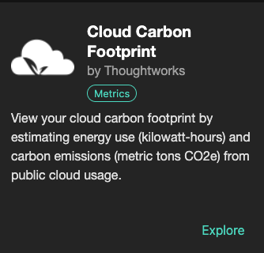

### CCF Backstage Plugins

Understand how your cloud usage impacts our environment and what you can do about it via the [Backstage](https://backstage.io/) developer portal.

This plugin brings the functionality of the open source project [Cloud Carbon Footprint](https://www.cloudcarbonfootprint.org/) into Backstage as an officially published plugin on the [Backstage Plugin Marketplace](https://backstage.io/plugins).

We have laid out steps to set up and run both the frontend and backend plugins within a Backstage created app in our [documentation](https://github.com/cloud-carbon-footprint/ccf-backstage-plugin).

These plugins are also open source and open to contributors to constantly improve and evolve!

