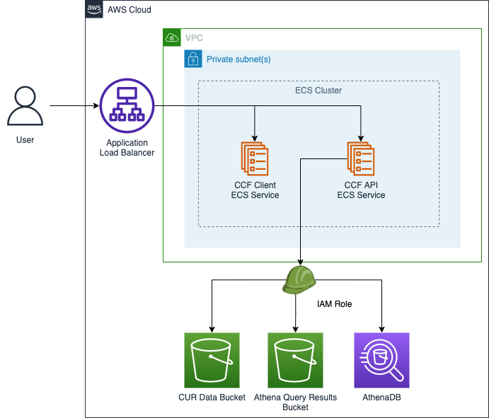

# CCF Infrastructure Setup on ECS (AWS/Terraform)

## Overview

This directory contains basic infrastructure code to set up the application in AWS using basic services such as ECS, IAM, Route53. The goal is to have a simple and generic setup that can be configured to each customer needs.

Although the aim was to remain generic, some things might not be entirely applicable to your particular case e.g. you might not have a VPN setup to access private compute instances. You should consider revisiting the architecture and adjusting the infrastructure accordingly.

### Architecture

The general architecture consists of the following components:

- ECS services, tasks and instance profile
- Security Group
- IAM Policies and Roles
- ALB, listeners, listener rules
- IP Target Groups
- CloudWatch logging group

#### Diagram

## How to use this module

### Terraform doc

Please find the details of how to use this Terraform project [here.](docs/TERRAFORM_DOC.md)

### Prerequisites

- Terraform >= 0.14.9 (tip: use [tfenv](https://github.com/tfutils/tfenv)) to manage multiple Terraform versions)

## How to use (basic step-by-step guide)

1. Make sure you have created an S3 bucket for the remote Terraform state file.
2. [Follow the example ec2 or ecs projects](examples) to set up some basic infrastructure before initialising the module using your preferred deployment
3. Run `terraform fmt`
4. Run `terraform validate` and make sure the configuration is valid
5. Run `terraform plan` and `terraform apply` against your cloud provider

© 2022 Thoughtworks, Inc.
